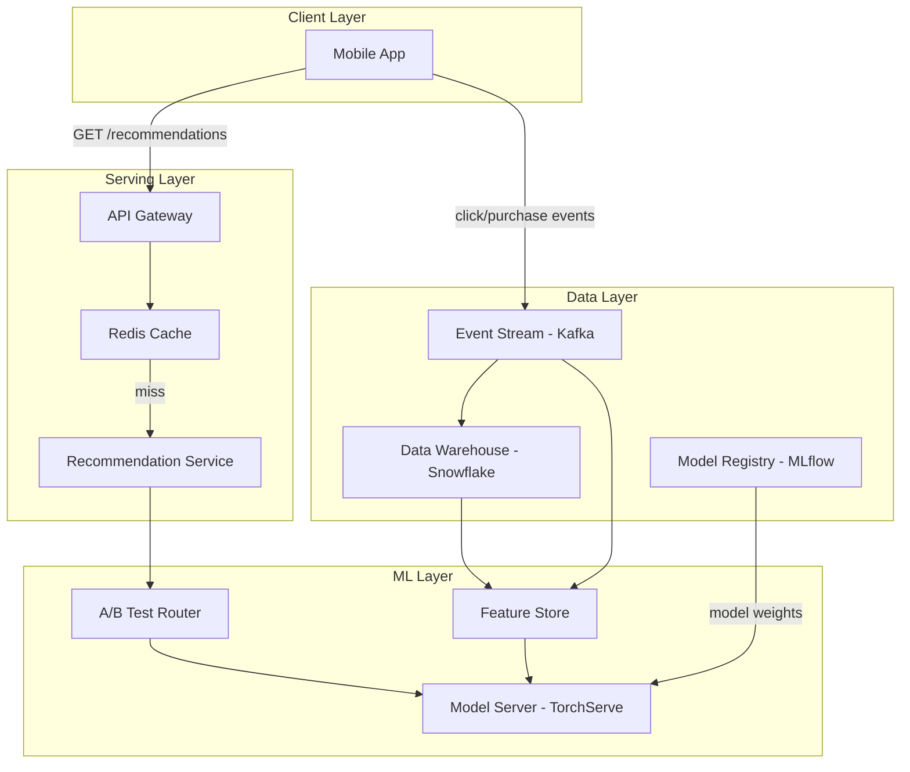

# Architecture: Personalized Recommendations (Scenario X)

## System Diagram

## Component Overview

| Component | Technology | Role |
|---|---|---|
| API Gateway | AWS API Gateway | Auth, rate limiting, routing |
| Recommendation Service | Python / FastAPI | Orchestration, cold-start fallback |
| Redis Cache | Redis 7 | Response cache, TTL 60s |
| Feature Store | Feast | Real-time + historical features |
| Model Server | TorchServe | Online inference |
| A/B Test Router | Custom | Traffic split between model versions |
| Event Stream | Kafka | Clickstream ingestion |
| Model Registry | MLflow | Versioning, promotion gates |
| Data Warehouse | Snowflake | Historical training data |