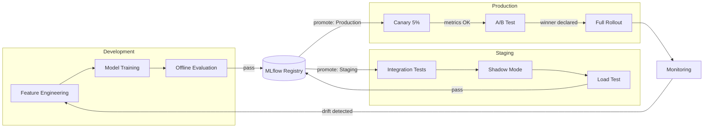

# Model Lifecycle: Personalized Recommendations

## End-to-End Diagram

## Gates

| Gate | Criteria | Approver |
|---|---|---|
| Dev → Staging | Offline NDCG@10 ≥ 0.42, coverage ≥ 85% | ML Engineer (automated) |
| Staging → Production | Shadow p95 < 90ms, zero errors in load test | ML Lead (manual sign-off) |
| Canary → Full | CTR uplift ≥ +2% vs baseline, p95 < 120ms | Product + ML Lead |
| Rollback trigger | Error rate > 1% or p95 > 150ms for 5 min | On-call (automated alert) |

## Retraining Schedule
- **Scheduled:** Weekly full retrain on last 90 days of event data.
- **Triggered:** If feature drift score (PSI) > 0.2 on any top-10 feature.